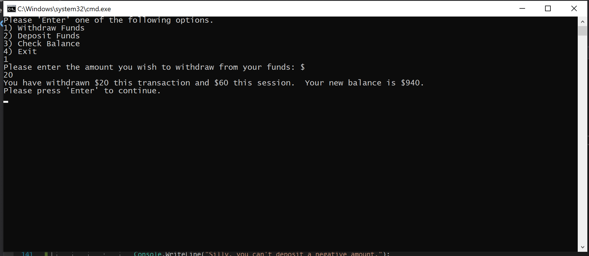

# lab02unittesting

> This program acts like an ATM.  It allows the user to withdrawl, deposit, and check their balance

This program allows the user to choose whether they want to add funds or withdraw funds and adjusts the balance accordingly.  I keeps tract of all deposits and withdrawals in seporate files.  After each transaction, a balance is displayed to the user.

## Table of Contents

- [Background](#background)
- [Install](#install)
- [Usage](#usage)
- [Maintainers](#maintainers)
- [Contributing](#contributing)
- [License](#license)

## Background

cf Lab 02: Unit Testing
To Submit this Assignment
Create a new repo on your personal GitHub account
Name your repo Lab##-TITLE
Create a branch named NAME-LAB##
Write your code
Commit often
Push to your repository
Create a pull request from your branch back your master branch.
Submit a link to your PR in canvas
Merge your PR back into master
In Canvas, Include the actual time it took you to complete the assignment as a comment (REQUIRED)
Include a README.md (contents described below)
Directions
The Problem Domain
Create a bank “ATM” machine within a console application with VS2017
Your solution should include the following:
Main method
Testable external methods
User interface that prompts the user for standard ATM operations
View Balance
Withdraw Money
Add Money (not standard, but for this exercise it will be….) =	- Keep asking the user to choose a transaction until they choose to ‘exit’ the application
Exception Handling. Implement try, catch, finally and a throw within your program.
A few things to keep in mind:
Make sure the user can’t go below a zero balance
You cannot unit test console WriteLine or Readlines.
Make sure your methods are just returning values and not reading input from the console.
When running your application, it should activate the user interface without any direct code manipulation

Stay within scope of the what we have learned so far in the class.
if we have not officially learned the concept you are trying to implement, then don’t use it.
Ask the instructor or TA if you have any questions about the scope.
Unit Tests
Provide unit tests for your ATM.
For every method/action (that does not require user input), there should be a passing valid input, and a passing invalid input.
Have at least 2 tests for every non-void method.
A failing test, is not a valid test - even if the failure is expected.
Stretch
Record each transaction the user records and when they exit, provide a receipt for every transaction they conducted.
README
A Readme is a requirement. No Readme == No Grade. 
Here are the requirements for a valid readme: 

A README is a module consumer’s first – and maybe only – look into your creation. The consumer wants a module to fulfill their need, so you must explain exactly what need your module fills, and how effectively it does so. 
Your job is to

tell them what it is (with context, provide a summary)
show them what it looks like in action (Visuals)
show them how they use it (Step by step directions, “Happy Path” walk through)
tell them any other relevant details 
This is your job. It’s up to the module creator to prove that their work is a shining gem in the sea of slipshod modules. Since so many developers’ eyes will find their way to your README before anything else, quality here is your public-facing measure of your work.

Refer to the sample-README in the class repo Resources folder for an example.

Reference

## Usage

The inital screen
)

Making the first Withdrawal
)

Each Withdrawal after that; notice that the message has changed
)

Making the first Deposit
)

Each Deposit after that; notice that the message has changed

Looking up the Balance

Exiting the program

## Maintainers

[@Michael-S-Kelly](https://github.com/Michael-S-Kelly)

## Contributing

Small note: If editing the README, please conform to the [standard-readme](https://github.com/RichardLitt/standard-readme) specification.

## License

MIT © 2019 Michael Kelly
